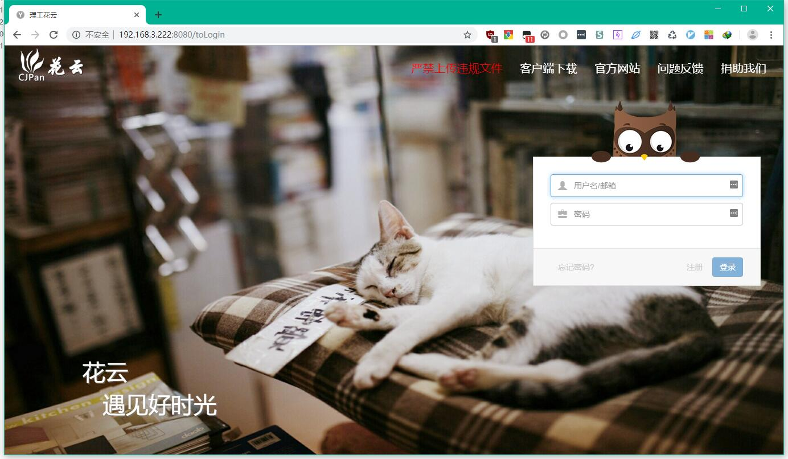
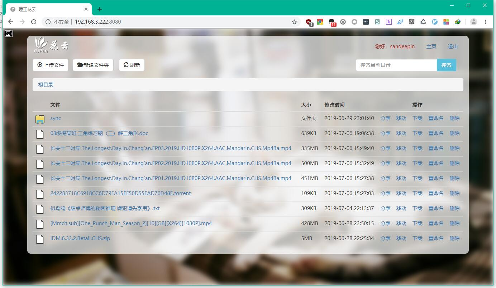

# CJPan
花云云盘

### 截图

### 使用说明
下载工程，编译打包，生成jar后运行：

**java -jar CJPan.jar --server.port=8080**

### 更新日志

当前开发中：花云云盘 v3.2

#### 2019年7月13日
* 新增容量显示
* 新增rmvb、rm、mkv、3gp在线播放支持
* SpringBoot框架升级2.1.6

#### 2019年07月12日 
* 新增avi和wmv支持，可以在ie浏览器下在线播放wmv和avi
* 修复ie浏览器播放视频的乱码问题
* 修复文件夹不能移动和重命名的问题
* 修复搜索后文件移动失败的问题

#### 2019年7月11日
* 优化代码，删除无用代码与依赖，最终生成的jar小于50M
* 新增一键音乐播放功能，自动播放云盘内所有MP3文件
* 新增图片预览功能
* 新增免登陆视频播放功能
* 新增分享文件预览功能，包括mp4、flv、mp3和图片
* 修复连续MP3播放出现不能展开的bug

#### 2019年7月10日
* 理工花云正式下线，花云云盘v3.2全功能定制版发布
* 新增在线播放视频功能，可在线播放mp4、flv
* 新增在线播放mp3功能，可播放云盘中的MP3文件
* 新增视频转码功能，支持将mkv、rm、rmvb、avi、wmv、3gp转码为mp4，实现在线播放
* 新增内外网分享切换功能，可以选择外网分享
* 修复windows下文件分享的功能
* 修复文件删除中出现的逻辑错误
* 删除部分冗余代码
* 修复windows下文件移动的功能
* 界面美化，使用新图标与全新背景

#### 2019年07月11日 理工云盘 v3.0
* Hprose远程调用版的多后端版本，由于功能尚不稳定，计划不采用此方案开发。

#### 2019年3月29日 理工云盘 v2.0
* 提交由朱翠等学妹学弟开发的扩展版本，主要扩展支持安卓，在线视频播放等功能。

#### 2018年3月19日 理工云盘 v1.0
* 异想家和国花在2018年开发的初版理工云盘，完成基本的网盘功能。

#### 2018年2月6日
* 花盘动工